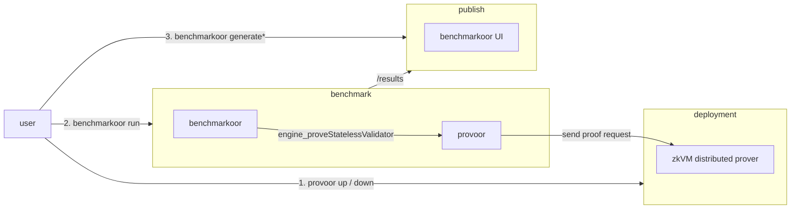

# Provoor

zkVM proving clusters as [Benchmarkoor](https://github.com/ethpandaops/benchmarkoor) targets.

## How it works

- `provoor up` deploys a proving cluster over SSH-reached Docker daemons, one coordinator plus GPU worker containers. The `zkvm` key selects one of the [zkVMs](#zkvms).
- `provoor serve` is a JSON-RPC forwarder that `benchmarkoor`[^forked-benchmarkoor] starts as a client container. To answer `engine_proveStatelessValidator`, it submits the stateless input to the cluster.
- The forwarder verifies every proof with the ere verifier against the `.vk` published beside the guest ELF. A test passes only when the verified public values match the expected output.
- Both `up` and `serve` check the key derived from the ELF against the configured one at startup. A mismatch stops both before the first measured proof.



[^forked-benchmarkoor]: The `benchmarkoor` submodule is a [fork](https://github.com/han0110/benchmarkoor) with `provoor` as a client target. It reads `statelessInputBytes` and `statelessOutputBytes` of the EEST fixture as the input and the expected output.

## zkVMs

| zkVM   | `zkvm`   | Client API port | Document                                   |
| ------ | -------- | --------------- | ------------------------------------------ |
| ZisK   | `zisk`   | 7000            | [docs/zkvm/zisk.md](docs/zkvm/zisk.md)     |
| OpenVM | `openvm` | 3000            | [docs/zkvm/openvm.md](docs/zkvm/openvm.md) |

Each document covers the image, ports, containers, volumes, configuration keys, budgets, behavior, and security of one zkVM.

## Deploy a cluster

```sh
cp .env.example .env
scripts/provoor.sh up --config examples/<zkvm>-4x4.example.yaml
scripts/provoor.sh down --config examples/<zkvm>-4x4.example.yaml
```

### Examples

| Example                                  | Deploys                                                                             |
| ---------------------------------------- | ----------------------------------------------------------------------------------- |
| `examples/<zkvm>-4x4.example.yaml`       | four hosts with four GPUs each, the hosts filled from `.env`                        |
| `examples/<zkvm>-1x1-local.example.yaml` | the coordinator and one worker on GPU 0 of the local Docker daemon, for development |

### Environment variables

| `.env` variable                    | Fills                                                                                                                                                  |
| ---------------------------------- | ------------------------------------------------------------------------------------------------------------------------------------------------------ |
| `NODE<n>_SSH`                      | `coordinator.ssh`, `workers[].ssh`, and `telemetry.sidecars[].ssh` in `examples/*.example.yaml`                                                        |
| `NODE<n>_IP`                       | `coordinator.ip` and `workers[].ip` in `examples/*.example.yaml`, and the `remote_metrics` endpoints in `benchmarkoor/examples/provoor/*.example.yaml` |
| `COORDINATOR_IP`                   | `--coordinator-endpoint` in `benchmarkoor/examples/provoor/*.example.yaml`                                                                             |
| `COORDINATOR_SSH`                  | the default `--ssh` of `scripts/sync.sh`                                                                                                               |
| `REMOTE_RESULTS_DIR`               | the default `--remote-results-dir` of `scripts/sync.sh`                                                                                                |
| `NODE<n>_HOST`, `NODE<n>_HOSTNAME` | no template, `scripts/desensitize.sh` replaces their values in results                                                                                 |

### Configuration

| Key                         | Default                          | Meaning                                                                            |
| --------------------------- | -------------------------------- | ---------------------------------------------------------------------------------- |
| `zkvm`                      | required                         | a value from [zkVMs](#zkvms), selects the package that reads the rest              |
| `zkvm_version`              | required                         | zkVM release the cluster proves under, names the cache volumes                     |
| `image`                     | `ghcr.io/han0110/provoor/<zkvm>` | cluster image                                                                      |
| `image_tag`                 | `zkvm_version`                   | cluster image tag                                                                  |
| `verbose`                   | `0`                              | container log level, 0 info, 1 debug, 2 trace                                      |
| `guests[].elf`              | required                         | guest ELF, a local path or an http(s) URL                                          |
| `guests[].vk`               | required                         | verifying key published beside the ELF, a local path or an http(s) URL             |
| `coordinator.ssh`           | local daemon                     | SSH destination of the coordinator host                                            |
| `coordinator.ip`            | none                             | address the workers on other hosts dial, required once a worker is on another host |
| `workers`                   | required, at least one           | per zkVM, see [zkVMs](#zkvms)                                                      |
| `telemetry.interval_ms`     | `100`                            | DCGM sampling period                                                               |
| `telemetry.sidecars[].ssh`  | local daemon                     | host of one sidecar, which runs a coordinator or worker                            |
| `telemetry.sidecars[].kind` | required                         | `dcgm-exporter` or `node-exporter`                                                 |
| `config`                    | per zkVM                         | prover settings, see [zkVMs](#zkvms)                                               |

| Sidecar kind    | Image                                                     | Port | Container             | Needs                                     |
| --------------- | --------------------------------------------------------- | ---- | --------------------- | ----------------------------------------- |
| `dcgm-exporter` | `nvcr.io/nvidia/k8s/dcgm-exporter:4.6.0-4.8.3-distroless` | 9401 | `provoor-dcgm-<host>` | `nvidia-dcgm.service` on `127.0.0.1:5555` |
| `node-exporter` | `quay.io/prometheus/node-exporter:v1.12.1`                | 9402 | `provoor-node-<host>` | nothing                                   |

- `scripts/provoor.sh` materializes a `*.example.yaml` template to the sibling `.yaml` before the CLI reads it. The CLI reads every other configuration as written.
- An unbraced `$NAME` placeholder or an unset `.env` variable stops the run.
- The CLI rejects unknown configuration keys.
- `up` is idempotent and streams its progress as `[label] message` lines. It leaves a running coordinator or worker alone and reports it as `already running`. Every `up` replaces a sidecar.
- `down` keeps the cache volumes and the journald logs, so the next `up` is fast. Read a log with `journalctl CONTAINER_NAME=<container>` on the host.
- Neither `up` nor `down` talks to the client API.
- A configured vk that differs from the key the cluster derives from the ELF fails `up`. The error identifies both keys.
- A telemetry failure does not fail `up`. The line `telemetry unavailable: ...` reports it, and an empty sidecar list prints `telemetry: no sidecars configured`.
- The first `up` is slow. Each zkVM prepares its proving keys and guest artifacts, minutes per guest on a GPU.

## Run a benchmark

```sh
scripts/benchmarkoor.sh run --config benchmarkoor/examples/provoor/<zkvm>-eest-v0.8.2-10M.example.yaml
```

| Flag                     | Default     | Meaning                                                                                                      |
| ------------------------ | ----------- | ------------------------------------------------------------------------------------------------------------ |
| `--zkvm`                 | required    | a value from [zkVMs](#zkvms)                                                                                 |
| `--stateless-validator`  | required    | stateless validator name, printed at startup                                                                 |
| `--elf`                  | required    | guest ELF source, a local path or a URL                                                                      |
| `--vk`                   | required    | guest verifying key source, a local path or a URL                                                            |
| `--coordinator-endpoint` | required    | coordinator client API endpoint, `http://<coordinator ip>:<client API port>`, the port is in [zkVMs](#zkvms) |
| `--listen`               | `:8551`     | JSON-RPC listen address                                                                                      |
| `--timeout`              | `10m`       | budget of one proof                                                                                          |
| `--on-cluster-error`     | `fail-test` | `fail-test` answers the error and continues, `fail-run` exits 1                                              |

The forwarder does these steps at startup.

1. Resolve the ELF and the vk.
2. Dial the cluster and provision the guest on it.
3. Wait for the cluster to report itself ready.
4. Print `stateless validator <name> ...` with the registration detail of the zkVM.
5. Prove the warmup block and check its output. Print `prover warmed in <duration>`.
6. Listen and print `listening on <address>`.

- One proof runs at a time.
- The forwarder waits for cluster readiness before each proof, on the request context and outside the measurement.
- The forwarder subtracts the time the cluster refused the submission from the measured proving time. `waited <duration> for the cluster to admit <hash>` reports a wait over one second.
- Each phase change prints `proving <hash> phase <phase>`.
- The forwarder verifies the public values with the ere verifier bound to `--vk` and compares them with `expectedStatelessOutput`. A mismatch answers `INVALID` with the committed `statelessOutput`.
- A cluster error answers JSON-RPC error `-32000`. With `fail-run` the process exits 1 while the client is still connected.
- `web3_clientVersion` answers the guest ELF name.
- The metric JSON line carries `block.number`, `block.hash`, `block.gas_used`, `timing.total_ms`, `throughput.mgas_per_sec`, `statelessInputSize`, `provingTimeMs`, `clusterReportedProvingTimeMs`, `proofSize`, and `outputMatched`.
- The warmup block is the 60M gas PUSH28 block of EEST `tests-zkevm-benchmark@v0.8.2`. It splits into about 230 segments, so every worker pays its one-time costs before the first measured proof.
- Run the benchmark on the coordinator host, which keeps stateless input transfer off the measured path.
- Forwarder flags travel through the instance `extra_args`. The run configurations set `ready_timeout: 15m`, since the forwarder listens only after the warmup.
- Results land in `provoor-runs/results` and render in the benchmarkoor UI.

## Publish results

1. Run `scripts/sync.sh`. It pulls the results into `provoor-runs/results` and desensitizes them.
2. Run `git checkout main` in `provoor-runs`. A clone and `scripts/build.sh benchmarkoor` leave the submodule on a detached HEAD.
3. Commit and push. The `deploy` workflow of `provoor-runs` publishes the site on every push to `main`.

[docs/publish-to-gh-page.md](docs/publish-to-gh-page.md) describes the pipeline and its limits.

## Development

### Prerequisites

1. Run `git clone --recursive https://github.com/han0110/provoor.git`.
2. Run `scripts/fetch-verifier.sh`.
3. Run `scripts/build.sh provoor`.
4. Run `scripts/build.sh benchmarkoor`.

| Tool                                      | Needed by                              |
| ----------------------------------------- | -------------------------------------- |
| Go 1.24.5 or later                        | build                                  |
| C compiler                                | cgo link of `libere_verifier_c`        |
| make                                      | `scripts/build.sh benchmarkoor`        |
| envsubst (GNU gettext)                    | `scripts/config.sh`                    |
| python3                                   | `scripts/desensitize.sh`               |
| rsync                                     | `scripts/sync.sh`                      |
| curl, tar, sha256sum or shasum            | `scripts/fetch-verifier.sh`            |
| ssh                                       | cluster hosts, `~/.ssh/config` applies |
| Docker with the NVIDIA container runtime  | every cluster host                     |
| `nvidia-dcgm.service` on `127.0.0.1:5555` | hosts with a `dcgm-exporter` sidecar   |

### Scripts

| Script                        | Does                                                                                                                                                                                                                                                                                             |
| ----------------------------- | ------------------------------------------------------------------------------------------------------------------------------------------------------------------------------------------------------------------------------------------------------------------------------------------------ |
| `scripts/config.sh` (sourced) | Resolves every `--config` value. It materializes a `*.example.yaml` template to the sibling `.yaml` from `.env` with `envsubst`. Every other `--config` path becomes absolute.                                                                                                                   |
| `scripts/provoor.sh`          | Runs the `provoor` built in the repository root, or the one on `PATH` when the repository root holds none.                                                                                                                                                                                       |
| `scripts/benchmarkoor.sh`     | Runs `benchmarkoor/bin/benchmarkoor` in the `provoor-runs` working directory. A relative `results_dir` and every relative argument other than `--config` resolve there.                                                                                                                          |
| `scripts/build.sh`            | `provoor` builds the CLI into the repository root. `benchmarkoor` resets every submodule to the recorded revision with `--force` and runs `make build-core`.                                                                                                                                     |
| `scripts/fetch-verifier.sh`   | Downloads `libere_verifier_c` of ere `ERE_VERSION` (v0.18.0) into `internal/ereverifier/lib` and checks the archive against its pinned sha256 digest.                                                                                                                                            |
| `scripts/sync.sh`             | Pulls the remote results with `rsync -a` into `provoor-runs/results`, then runs `scripts/desensitize.sh`. Flags `--ssh USER@HOST` and `--remote-results-dir DIR` default to `COORDINATOR_SSH` and `REMOTE_RESULTS_DIR` in `.env`. Excludes `container.log`, `benchmarkoor.log`, and `*.request`. |
| `scripts/desensitize.sh`      | Replaces every non-empty `.env` value in `provoor-runs/results` with its variable name. Longer values apply first and ties keep `.env` order. The script skips gzip files. A final scan fails the script when a value survives.                                                                  |

- Run `scripts/fetch-verifier.sh` again when `ERE_VERSION` changes. A stale library rejects the proofs of a current cluster.
- `scripts/build.sh benchmarkoor` overwrites uncommitted work in a submodule.
- `scripts/desensitize.sh` is idempotent. A second run finds nothing to replace.

### Container images

| Image                             | Built from                       | Tag                              | Published by                                                   |
| --------------------------------- | -------------------------------- | -------------------------------- | -------------------------------------------------------------- |
| `ghcr.io/han0110/provoor/provoor` | `dockers/Dockerfile`             | the release version and `latest` | `.github/workflows/release.yaml` on each release               |
| `ghcr.io/han0110/provoor/zisk`    | `dockers/zkvm/Dockerfile.zisk`   | `1.2.0-alpha`                    | `.github/workflows/publish-zkvm-image.yaml` on manual dispatch |
| `ghcr.io/han0110/provoor/openvm`  | `dockers/zkvm/Dockerfile.openvm` | `2.1.0-preview`                  | `.github/workflows/publish-zkvm-image.yaml` on manual dispatch |

```sh
docker build -f dockers/Dockerfile -t ghcr.io/han0110/provoor/provoor:latest .
docker build -f dockers/Dockerfile --build-arg VERIFIER_LIB=local -t provoor:local .
```

- `VERIFIER_LIB=local` takes the library already in `internal/ereverifier/lib`, for an ere revision with no release. The build fails when the directory does not exist. `release`, the default, downloads the pinned asset in a stage of its own, so source edits do not repeat the download.
- `VERSION` stamps `provoor --version`, `dev` unless set. The release workflow passes the release tag.
- The cluster image tag is the zkVM release it carries, which is the `zkvm_version` a cluster configuration names.

### Add a zkVM

1. Add `internal/<zkvm>` with the entry points `Load`, `Up`, `Down`, and `Dial` of the existing packages.
2. Add the `zkvm` value to `cmd/provoor/main.go`.
3. Add `dockers/zkvm/Dockerfile.<zkvm>`, and the `zkvm` choice and its `case` arm in `.github/workflows/publish-zkvm-image.yaml`.
4. Add `examples/<zkvm>-4x4.example.yaml` and `examples/<zkvm>-1x1-local.example.yaml`, and load both in `TestLoadExamples` of `internal/<zkvm>/config_test.go`.
5. Add the run configurations under `benchmarkoor/examples/provoor/`.
6. Add `docs/zkvm/<zkvm>.md` with the sections of the existing documents, and a row in [zkVMs](#zkvms) and [Container images](#container-images).

`Dial` binds an `ereverifier` kind, so the pinned ere release must verify the zkVM.

## Security

- `provoor serve` answers unauthenticated JSON-RPC on `:8551`.
- The exporter ports 9401 and 9402 are open on every interface of a host with a sidecar.
- Each zkVM opens its cluster ports on every interface of its hosts. The Security section of its document in [zkVMs](#zkvms) lists them.
- Keep these hosts on a private network or firewall the ports.
