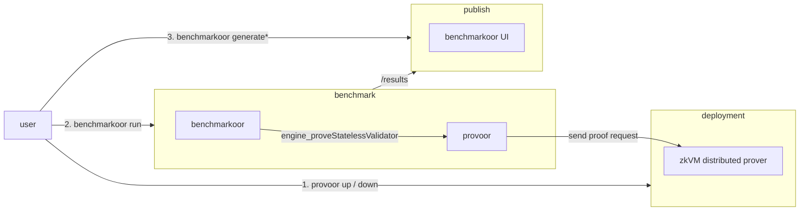

# Provoor

zkVM proving clusters as benchmarkoor targets.

## Install

Clone with submodules, since benchmarkoor and the published runs checkout are
tracked here.

```sh
git clone --recursive https://github.com/han0110/provoor.git
```

Build the CLI from source with Go 1.24.5 or later and a C compiler, since
proof verification links the `libere_verifier_c` static library through cgo.
`scripts/fetch-verifier.sh` downloads that library as a release asset of the
ere version the Go binding is vendored from, so a fresh checkout fetches it
once before building.

```sh
scripts/fetch-verifier.sh
scripts/build.sh provoor
```

`scripts/build.sh benchmarkoor` builds the other binary a run needs, resetting
every submodule to the revision this repository records first, so a submodule
carrying uncommitted work is overwritten. It needs `make` alongside Go.
`scripts/benchmarkoor.sh` runs that build's output rather than a binary on
`PATH`, so build it before the first run and again after moving the submodule.

The scripts under `scripts/` additionally need `envsubst` from GNU gettext and
`python3`.

The container image benchmark runs use builds from the repository root. A
tagged release publishes the same build to `ghcr.io/han0110/provoor`, stamped
with its version rather than the `dev` a local build carries.

```sh
docker build -t ghcr.io/han0110/provoor:latest .
```

The image links the verifier library `scripts/fetch-verifier.sh` downloads.
Building against an ere revision that has no release yet takes the library from
`pkg/ereverifier/lib` instead, which is what `VERIFIER_LIB=local` selects. Put
one there first, since the build fails rather than falling back.

```sh
docker build --build-arg VERIFIER_LIB=local -t provoor:local .
```

## How it works

`provoor up` deploys a proving cluster, a coordinator plus GPU worker
containers, over SSH-reached Docker daemons. ZisK and OpenVM are supported,
selected by the `zkvm` field of the cluster configuration. `provoor serve` is
a JSON-RPC forwarder that benchmarkoor starts as a client container. It
answers `engine_proveStatelessValidator` by submitting the stateless input to the
cluster, so a proving benchmark runs with the same lifecycle, results, and UI
as an execution-client benchmark. Every returned proof is cryptographically
verified through the verifier ere releases, against the verifying key the
forwarder's own configuration names, and a test passes when the public values
that verification proves match the fixture's expected output. A proof of another
program, or one altered in transit, fails its test rather than being reported
as a passing measurement. The key comes from outside the deployment, the
signed `.vk` asset published beside the guest ELF, so the guest release rather
than the cluster decides what a proof has to be about. The cluster's own
derivation from the uploaded ELF is a cross-check, compared against the
configured key at `up` and again when the forwarder starts, and a mismatch
stops both before any proof is measured.



## Deploy a cluster

The examples under `examples/` describe a cluster of four hosts with four GPUs
each. Their addresses come from `.env`, so copy `.env.example`, fill it in, and
drive the CLI through `scripts/provoor.sh`, which materializes the template
before handing it over. A placeholder with no value stops the run rather than
deploying against an empty address.

```sh
cp .env.example .env
scripts/provoor.sh up --config examples/openvm-4x4.example.yaml
```

SSH destinations are resolved by the local `ssh` binary, so aliases, keys, and
the agent from `~/.ssh/config` apply. Hosts need Docker with the NVIDIA
container runtime. A cluster of another shape is an ordinary config file,
which `provoor up --config` takes directly. A ZisK deployment also talks to the
coordinator's client API, where it sets its guests up, and reaches it over the
coordinator's own SSH destination rather than over the data network, so a
bastion whose proxy carries no cluster traffic still works. That needs TCP
forwarding permitted on the coordinator's SSH server.

Each `guests` entry pairs an `elf` source with the `vk` source published beside
it, both a local path or an `eth-act/ere-guests` release asset URL. `up` fails
when the key the cluster derives differs from the configured one, printing
both.

`up` is idempotent and streams its progress. The first run is slow, ZisK
downloads and prepares the proving key, and OpenVM derives a keyset per guest
ELF listed under `guests`, minutes per program on a GPU.

A ZisK worker that runs two setups in a row, without proving the first between
them, can no longer prove the earlier guest. `up` provisions every guest in
exactly that order, so it restarts the cluster afterwards. Each forwarder then
sets its own guest up and proves it immediately, reusing the assembly `up`
compiled rather than compiling it again.

```sh
scripts/provoor.sh down --config examples/openvm-4x4.example.yaml
```

`down` removes the containers and keeps the cached volumes and journald logs,
so the next `up` is fast and past logs stay readable.

The coordinator and worker APIs bind every interface, and `provoor serve`
answers unauthenticated JSON-RPC on its listen address, so keep these hosts on
a private network or firewall their ports.

## Run a benchmark

Run configurations live with the harness that reads them, under
`benchmarkoor/examples/provoor/`. `scripts/benchmarkoor.sh` fills their
`${COORDINATOR_IP}` placeholder from `.env` and runs benchmarkoor in the
`provoor-runs` checkout, so a config's relative `results_dir` lands there.
Run it on the coordinator host, which keeps witness transfer off the measured
path.

```sh
scripts/build.sh benchmarkoor
scripts/benchmarkoor.sh run --config benchmarkoor/examples/provoor/openvm-eest-v0.6.2-10M.example.yaml
```

The forwarder flags travel through the instance `extra_args`. `--elf` and
`--vk` name the same release assets as the cluster's `guests` entry, and for
OpenVM the ELF must be byte-identical to it. Before opening its port the
forwarder checks the cluster's key against `--vk` and proves a small warmup
block, so a mismatched deployment never serves a request and a cold cluster's
one-time costs never land in a measured test.
Results land in `provoor-runs/results` and render in the benchmarkoor UI,
including live proof phases, per-test proving times, and opcode heatmaps.

## Publish results

A completed results directory publishes to GitHub Pages as a static site, the
benchmarkoor UI plus pruned metrics, with no server. The `provoor-runs`
submodule automates it on every push to its `main`, and
[docs/publish-to-gh-page.md](docs/publish-to-gh-page.md) covers how that
pipeline fits together and what constrains it. A run leaves the submodule on a
detached HEAD, so committing results there starts with `git checkout main`.
