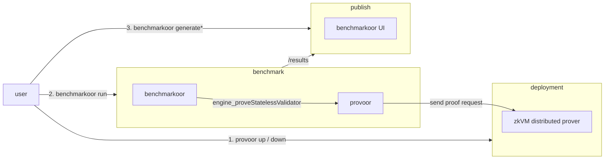

# Provoor

zkVM proving clusters as benchmarkoor targets.

## Install

Clone with submodules, since benchmarkoor and the published runs checkout are
tracked here.

```sh
git clone --recursive https://github.com/han0110/provoor.git
```

Build the CLI from source with Go 1.24.5 or later.

```sh
go build -o provoor ./cmd/provoor
```

The scripts under `scripts/` additionally need `envsubst` from GNU gettext and
`python3`, and running a benchmark needs a `benchmarkoor` binary on `PATH`,
built from the `benchmarkoor` submodule following its own README.

The container image benchmark runs use builds from the repository root. A
tagged release publishes the same build to `ghcr.io/han0110/provoor`, stamped
with its version rather than the `dev` a local build carries.

```sh
docker build -t ghcr.io/han0110/provoor:latest .
```

## How it works

`provoor up` deploys a proving cluster, a coordinator plus GPU worker
containers, over SSH-reached Docker daemons. ZisK and OpenVM are supported,
selected by the `zkvm` field of the cluster configuration. `provoor serve` is
a JSON-RPC forwarder that benchmarkoor starts as a client container. It
answers `engine_proveStatelessValidator` by submitting the stateless input to the
cluster, so a proving benchmark runs with the same lifecycle, results, and UI
as an execution-client benchmark. A test passes when the cluster's public
values match the fixture's expected output. The proof envelope itself is not
cryptographically verified yet, so published timings assume a trusted cluster.



## Deploy a cluster

The examples under `examples/` describe a cluster of four hosts with four GPUs
each. Their addresses come from `.env`, so copy `.env.example`, fill it in, and
drive the CLI through `scripts/provoor.sh`, which materializes the template
before handing it over. A placeholder with no value stops the run rather than
deploying against an empty address.

```sh
cp .env.example .env
scripts/provoor.sh up --config examples/openvm-4x4.example.yaml
```

SSH destinations are resolved by the local `ssh` binary, so aliases, keys, and
the agent from `~/.ssh/config` apply. Hosts need Docker with the NVIDIA
container runtime. A cluster of another shape is an ordinary config file,
which `provoor up --config` takes directly.

`up` is idempotent and streams its progress. The first run is slow, ZisK
downloads and prepares the proving key, and OpenVM derives a keyset per guest
ELF listed under `guests`, minutes per program on a GPU.

```sh
scripts/provoor.sh down --config examples/openvm-4x4.example.yaml
```

`down` removes the containers and keeps the cached volumes and journald logs,
so the next `up` is fast and past logs stay readable.

The coordinator and worker APIs bind every interface, and `provoor serve`
answers unauthenticated JSON-RPC on its listen address, so keep these hosts on
a private network or firewall their ports.

## Run a benchmark

Run configurations live with the harness that reads them, under
`benchmarkoor/examples/provoor/`. `scripts/benchmarkoor.sh` fills their
`${COORDINATOR_IP}` placeholder from `.env` and runs benchmarkoor in the
`provoor-runs` checkout, so a config's relative `results_dir` lands there.
Run it on the coordinator host, which keeps witness transfer off the measured
path.

```sh
scripts/benchmarkoor.sh run --config benchmarkoor/examples/provoor/openvm-eest-v0.6.2-10M.example.yaml
```

The forwarder flags travel through the instance `extra_args`. `--elf`
takes a local path or an `eth-act/ere-guests` release asset URL, and for
OpenVM it must be byte-identical to the cluster's `guests` entry. Before
opening its port the forwarder proves a small warmup block, so a cold
cluster's one-time costs never land in a measured test.
Results land in `provoor-runs/results` and render in the benchmarkoor UI,
including live proof phases, per-test proving times, and opcode heatmaps.

## Publish results

A completed results directory publishes to GitHub Pages as a static site, the
benchmarkoor UI plus pruned metrics, with no server. The `provoor-runs`
submodule automates it on every push to its `main`, and
[docs/publish-to-gh-page.md](docs/publish-to-gh-page.md) covers how that
pipeline fits together and what constrains it.
