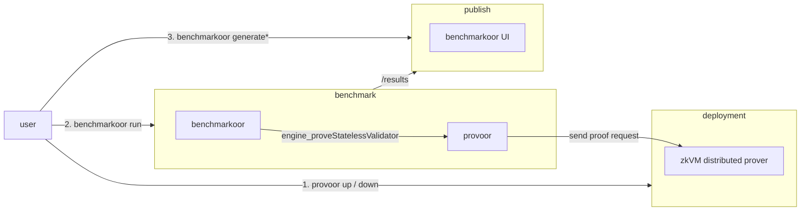

# Provoor

zkVM proving clusters as benchmarkoor targets.

## Install

Clone with submodules, since benchmarkoor and the published runs checkout are
tracked here.

```sh
git clone --recursive https://github.com/han0110/provoor.git
```

Building needs Go 1.24.5 or later and a C compiler, because proof verification
links `libere_verifier_c` through cgo. `scripts/fetch-verifier.sh` downloads
that library. Run it again whenever the ere version it pins changes, since a
stale library rejects proofs a current cluster produces.

```sh
scripts/fetch-verifier.sh
scripts/build.sh provoor
scripts/build.sh benchmarkoor
```

`scripts/build.sh benchmarkoor` needs `make` and resets every submodule to the
revision this repository records, overwriting uncommitted work in a submodule.
`scripts/benchmarkoor.sh` runs that build rather than a binary on `PATH`. The
scripts under `scripts/` also need `envsubst` from GNU gettext and `python3`.

## Container images

Benchmark runs use the provoor image built from `dockers/Dockerfile`. A tagged
release publishes it to `ghcr.io/han0110/provoor/provoor`, stamped with its
version instead of the `dev` a local build carries.

```sh
docker build -f dockers/Dockerfile -t ghcr.io/han0110/provoor/provoor:latest .

# Against an ere revision with no release yet, taking the library already in
# pkg/ereverifier/lib. The build fails when it is missing rather than falling back.
docker build -f dockers/Dockerfile --build-arg VERIFIER_LIB=local -t provoor:local .
```

Clusters pull one image per zkVM, `ghcr.io/han0110/provoor/zisk` and
`ghcr.io/han0110/provoor/openvm`, built from `dockers/zkvm/`. Each is tagged
with the zkVM release it carries, which is the `zkvm_version` a cluster
configuration names.

## How it works

`provoor up` deploys a proving cluster over SSH-reached Docker daemons, a
coordinator plus GPU worker containers. The `zkvm` field of the cluster
configuration selects ZisK or OpenVM.

`provoor serve` is a JSON-RPC forwarder that benchmarkoor starts as a client
container. It answers `engine_proveStatelessValidator` by submitting the
stateless input to the cluster, so a proving benchmark runs with the same
lifecycle, results, and UI as an execution-client benchmark.

Every proof is verified with the verifier from an ere release, against the key
published as the `.vk` asset beside the guest ELF rather than one the cluster
supplies. A test passes only when the verified public values match the
fixture's expected output, so a proof of another program, or one altered in
transit, fails its test instead of passing as a measurement. The key derived
from the ELF is compared against the configured one at `up` and again when the
forwarder starts, and a mismatch stops both before any proof is measured.



## Deploy a cluster

The examples under `examples/` describe four hosts with four GPUs each. Their
addresses come from `.env`, so copy `.env.example`, fill it in, and drive the
CLI through `scripts/provoor.sh`, which fills the template first. A placeholder
with no value stops the run instead of deploying against an empty address.

```sh
cp .env.example .env
scripts/provoor.sh up --config examples/openvm-4x4.example.yaml
scripts/provoor.sh down --config examples/openvm-4x4.example.yaml
```

- SSH destinations resolve through the local `ssh` binary, so aliases, keys,
  and the agent from `~/.ssh/config` apply.
- Hosts need Docker with the NVIDIA container runtime.
- A cluster of another shape is an ordinary config file, which `provoor up
  --config` takes directly.
- Each `guests` entry pairs an `elf` source with the `vk` published beside it,
  both a local path or an `eth-act/ere-guests` release asset URL. `up` fails
  when the key derived from the ELF differs, printing both.
- `up` is idempotent and streams its progress, and `down` keeps the cached
  volumes and journald logs so the next `up` is fast.
- `telemetry.sidecars` lists the metric exporters to run, one entry per host
  and kind. `dcgm-exporter` publishes GPU counters on port 9401 and reads the
  node's own `nvidia-dcgm.service` on loopback port 5555. `node-exporter`
  publishes processor and memory counters on port 9402 and needs nothing from
  the host. An empty list runs no sidecar, and `up` says so.

The first `up` is slow, since ZisK downloads and prepares the proving key and
OpenVM derives a keyset for each guest ELF, minutes per program on a GPU.

A ZisK `up` compiles every guest before it starts the cluster, running
`cargo-zisk-dev-gpu program-setup` once per guest on each worker host. That
writes the ROM setup and the assembly emulator into the host's artifact cache
and derives the guest's verifying key, which `up` checks against the configured
one. The forwarder's own setup then reads the cache instead of generating
either, so the minutes that work takes never land inside a benchmark run.

Compiling a guest allocates the whole device, which is why it runs before the
coordinator and the workers rather than against a live cluster. Neither `up`
nor `down` talks to the coordinator's client API.

A ZisK coordinator runs under `zisk-supervisor`, built into the cluster image
from `cmd/zisk-supervisor` and taking restart requests on port 7002. The
coordinator records every guest it has set up, never drops an entry, and
replays all of them to each worker that registers. Two entries mean
two setups in a row on one worker process, which corrupts the earlier guest.
Ending the coordinator is the only way to clear that record, so each forwarder
asks for that before it registers its own guest, and the container's restart
policy starts the replacement. One benchmark run therefore covers several
guests without a redeployment between them.

The supervisor ends the coordinator and nothing else, so a coordinator that
fails on its own carries its own exit code out of the container. The
coordinator's restart count climbs by one per guest as well as per failure, so
it does not count crashes on its own.

The coordinator and worker APIs bind every interface, `provoor serve` answers
unauthenticated JSON-RPC, and the supervisor takes a restart from anyone who
sends it the word, so keep these hosts on a private network or firewall their
ports.

## Run a benchmark

Run configurations live with the harness that reads them, under
`benchmarkoor/examples/provoor/`. `scripts/benchmarkoor.sh` fills their
`${COORDINATOR_IP}` placeholder from `.env` and runs benchmarkoor in the
`provoor-runs` checkout, so a config's relative `results_dir` lands there. Run
it on the coordinator host, which keeps witness transfer off the measured path.

```sh
scripts/benchmarkoor.sh run --config benchmarkoor/examples/provoor/openvm-eest-v0.8.2-10M.example.yaml
```

Forwarder flags travel through the instance `extra_args`. `--elf` and `--vk`
name the same release assets as the cluster's `guests` entry, and for OpenVM
the ELF must be byte-identical to it.

Before opening its port the forwarder checks the cluster's key against `--vk`
and proves a small warmup block, so a mismatched deployment never serves a
request and a cold cluster's one-time costs never land in a measured test. A
ZisK forwarder restarts the coordinator first and waits out the workers
reconnecting, so its guest is the only one the cluster has set up.

The forwarder waits for the cluster to report itself ready before timing any
test. The wait runs on the request and carries no budget of its own, since a
wait cut short leaves the rest of a recovery to land inside the next block's
measurement. That readiness covers a worker that dropped out, not a cluster
that is draining an earlier proof. A coordinator answers on worker
registration and worker health, neither of which sees a proof that still holds
the cluster or a worker whose provers are all busy, so it reports itself ready
while it refuses work. A measured time therefore also discounts the
submissions the cluster refused, so only the attempt it admitted counts as
proving the block.

Results land in `provoor-runs/results` and render in the benchmarkoor UI,
including live proof phases, per-test proving times, and opcode heatmaps.

## Publish results

A completed results directory publishes to GitHub Pages as a static site, the
benchmarkoor UI plus pruned metrics, with no server. The `provoor-runs`
submodule automates it on every push to its `main`, and
[docs/publish-to-gh-page.md](docs/publish-to-gh-page.md) covers how that
pipeline fits together and what constrains it. A run leaves the submodule on a
detached HEAD, so committing results there starts with `git checkout main`.
