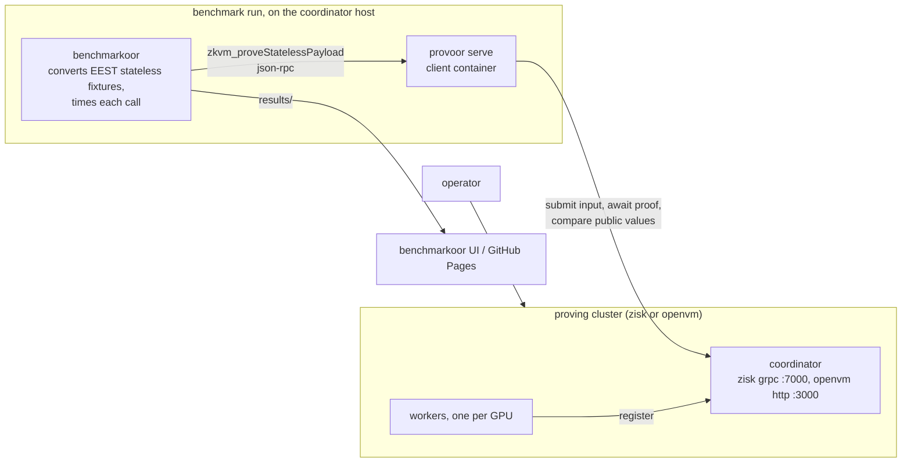

# Provoor

zkVM proving clusters as benchmarkoor targets.

## Install

Build the CLI from source with Go 1.24.5 or later:

```sh
go build -o provoor ./cmd/provoor
```

The container image used by benchmark runs builds from the repository root:

```sh
docker build -t ghcr.io/han0110/provoor:latest .
```

## How it works

`provoor up` deploys a proving cluster, a coordinator plus GPU worker
containers, over SSH-reached Docker daemons. ZisK and OpenVM are supported,
selected by the `zkvm` field of the cluster configuration. `provoor serve` is
a JSON-RPC forwarder that benchmarkoor starts as a client container. It
answers `zkvm_proveStatelessPayload` by submitting the stateless input to the
cluster, so a proving benchmark runs with the same lifecycle, results, and UI
as an execution-client benchmark.



## Deploy a cluster

Copy the example for the backend and fill in the placeholders. SSH
destinations are resolved by the local `ssh` binary, so aliases, keys, and
the agent from `~/.ssh/config` apply. Hosts need Docker with the NVIDIA
container runtime.

```sh
cp examples/zisk-cluster.example.yaml cluster.yaml   # or openvm-cluster.example.yaml
provoor up --config cluster.yaml
```

`up` is idempotent and streams its progress. The first run is slow, ZisK
downloads and prepares the proving key, and OpenVM derives a keyset per guest
ELF listed under `guests`, minutes per program on a GPU.

```sh
provoor down --config cluster.yaml
```

`down` removes the containers and keeps the cached volumes and journald logs,
so the next `up` is fast and past logs stay readable.

## Run a benchmark

Copy the run configuration, fill in the coordinator address and the guest ELF
source, and run benchmarkoor on the coordinator host so witness transfer
stays off the measured path.

```sh
cp examples/zkevm-benchmark.example.yaml zkvm-benchmark.yaml
benchmarkoor run --config zkvm-benchmark.yaml
```

The forwarder flags travel through the instance `extra_args`. `--guest-elf`
takes a local path or an `eth-act/ere-guests` release asset URL, and for
OpenVM it must be byte-identical to the cluster's `guests` entry. Before
opening its port the forwarder proves a small warmup block, so a cold
cluster's one-time costs never land in a measured test.
Results land in `./results` and render in the benchmarkoor UI, including live
proof phases, per-test proving times, and opcode heatmaps.

## Publish results

A completed results directory publishes to GitHub Pages as a static site, the
benchmarkoor UI plus pruned metrics, with no server. The step-by-step manual
is [docs/publish-to-gh-page.md](docs/publish-to-gh-page.md).
