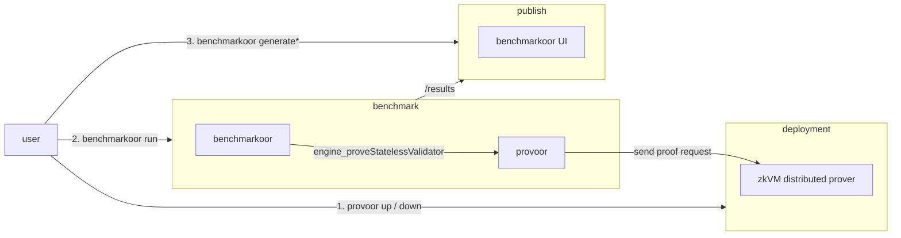

# Provoor

zkVM proving clusters as [Benchmarkoor](https://github.com/ethpandaops/benchmarkoor) targets.

## How it works

- `provoor up` deploys a proving cluster over SSH-reached Docker daemons, one coordinator plus GPU worker containers. The `zkvm` key selects one of the [zkVMs](#zkvms).
- `provoor serve` is a JSON-RPC forwarder that `benchmarkoor`[^forked-benchmarkoor] starts as a client container. To answer `engine_proveStatelessValidator`, it submits the stateless input to the cluster.
- `provoor estimate` executes the guest program of a finished run on the input of each test, in an [ere-server](https://github.com/eth-act/ere) container. It also executes the guest program of each instance of a benchmarkoor configuration. It records what one execution costs.
- The forwarder verifies every proof with the ere verifier against the `.vk` published beside the guest ELF. A test passes only when the verified public values match the expected output.
- Both `up` and `serve` check the key derived from the ELF against the configured one at startup. A mismatch stops both before the first measured proof.


```mermaid
flowchart LR
    subgraph deployment
        cluster["zkVM distributed prover"]
    end

    subgraph benchmark
        benchmarkoor["benchmarkoor"]
        provoor["provoor"]
        benchmarkoor -- "engine_proveStatelessValidator" --> provoor
        provoor -- "send proof request" --> cluster
    end

    subgraph publish
        benchmarkoor_ui["benchmarkoor UI"]
    end

    benchmark -- "/results" --> publish

    user -- "1. provoor up / down" --> deployment
    user -- "2. benchmarkoor run" --> benchmark
    user -- "3. benchmarkoor generate*" --> publish
```

[^forked-benchmarkoor]: The `benchmarkoor` submodule is a [fork](https://github.com/han0110/benchmarkoor) with `provoor` as a client target. It reads `statelessInputBytes` and `statelessOutputBytes` of the EEST fixture as the input and the expected output.

## zkVMs

| zkVM   | `zkvm`   | Client API port | Document                                   |
| ------ | -------- | --------------- | ------------------------------------------ |
| ZisK   | `zisk`   | 7000            | [docs/zkvm/zisk.md](docs/zkvm/zisk.md)     |
| OpenVM | `openvm` | 3000            | [docs/zkvm/openvm.md](docs/zkvm/openvm.md) |

## Deploy a cluster

```sh
cp .env.example .env
scripts/provoor.sh up --config examples/<zkvm>-4x4.example.yaml
scripts/provoor.sh down --config examples/<zkvm>-4x4.example.yaml
```

`<zkvm>-4x4` deploys four hosts with four GPUs each, and `<zkvm>-1x1-local` deploys one GPU on the local Docker daemon.

- `up` is idempotent and leaves running containers alone. The first `up` is slow, because each zkVM prepares its proving keys and guest artifacts.
- `up` and `serve` stop when the key derived from the ELF differs from the configured `.vk`.
- `down` keeps the cache volumes and the journald logs, so the next `up` is fast.

### Environment variables

The tracked `*.example.yaml` templates hold `${...}` placeholders instead of real hosts. `scripts/provoor.sh` and `scripts/benchmarkoor.sh` fill them from `.env`, which git ignores, and an unset variable stops them. Fill `.env` once per rig.

| Variable                                | Set it to                                                | Used by                                       |
| --------------------------------------- | -------------------------------------------------------- | --------------------------------------------- |
| `NODE<n>_SSH`                           | SSH destination of node n, or a `~/.ssh/config` alias    | `provoor up`, `down`, `ps`, `logs`            |
| `NODE<n>_IP`                            | private IP of node n                                     | cluster wiring and the benchmark metrics      |
| `COORDINATOR_IP`                        | private IP of the coordinator node                       | the forwarder in the benchmark configurations |
| `COORDINATOR_SSH`, `REMOTE_RESULTS_DIR` | SSH destination and results directory of the coordinator | `scripts/sync.sh`                             |
| `NODE<n>_HOST`, `NODE<n>_HOSTNAME`      | public domain and short hostname of node n               | `scripts/desensitize.sh` only                 |

`scripts/sync.sh` replaces every `.env` value in the synced results with its variable name. Set every value that can appear in a log, so published results carry no rig address.

### Configuration

| Key                    | Meaning                                                            |
| ---------------------- | ------------------------------------------------------------------ |
| `zkvm`, `zkvm_version` | zkVM and its release, which also picks the image tag               |
| `guests[].elf`, `.vk`  | guest ELF and verifying key, a local path or a URL                 |
| `coordinator`          | `ssh` destination (local daemon when omitted) and `ip` of the host |
| `workers`              | worker hosts and GPUs, see the zkVM document                       |
| `telemetry.sidecars`   | `dcgm-exporter` (port 9401) and `node-exporter` (port 9402) hosts  |
| `config`               | prover settings, see the zkVM document                             |

## Inspect a cluster

```sh
scripts/provoor.sh ps --config examples/<zkvm>-4x4.example.yaml
scripts/provoor.sh logs --config examples/<zkvm>-4x4.example.yaml --follow
./provoor logs dump --config examples/<zkvm>-4x4.example.yaml --run provoor-runs/results/runs/<run_id>
```

`logs dump` writes the coordinator and worker logs of a run's time window into the run directory. It reads the journal of every host as the SSH user, so that user needs the `adm` or `systemd-journal` group, or passwordless sudo with `--sudo`.

## Run a benchmark

```sh
scripts/benchmarkoor.sh run --config benchmarkoor/examples/provoor/<zkvm>-eest-v0.8.2-10M.example.yaml
```

Run it on the coordinator host, so the stateless input reaches the cluster over loopback. Results land in `provoor-runs/results/runs`. The run configuration passes these forwarder flags through the instance `extra_args`.

| Flag                              | Default     | Meaning                                                         |
| --------------------------------- | ----------- | --------------------------------------------------------------- |
| `--zkvm`, `--stateless-validator` | required    | zkVM and guest name                                             |
| `--elf`, `--vk`                   | required    | guest ELF and verifying key, a local path or a URL              |
| `--coordinator-endpoint`          | required    | `http://<coordinator ip>:<client API port>`                     |
| `--listen`                        | `:8551`     | JSON-RPC listen address                                         |
| `--timeout`                       | `10m`       | budget of one proof                                             |
| `--on-cluster-error`              | `fail-test` | `fail-test` answers the error and continues, `fail-run` exits 1 |

- At startup the forwarder proves a warmup block, the 60M gas PUSH28 block that execution-specs `tests/benchmark` fills at `tests-zkevm@v21.0.1`, so every worker pays its one-time costs before the first measured proof. It listens only after the warmup, so the run configurations set `ready_timeout: 15m`.
- One proof runs at a time.
- A test passes only when the verified public values match the expected output. A cluster error answers JSON-RPC error `-32000`.
- After a failed proof the forwarder proves the warmup block again, so the next test starts on a recovered cluster.

## Estimate cost

```sh
./provoor estimate provoor-runs/results/runs/<run_id>
(cd provoor-runs && ../provoor estimate ../benchmarkoor/examples/provoor/<file>.example.yaml)
./provoor estimate link provoor-runs/results/runs/<run_id> provoor-runs/results/estimates/<estimate_id>
```

`estimate` executes the guest on the input of every test in an ere-server container on the local CPU, so it needs no cluster and no GPU. Each test gets its cost per component and its peak heap use in `estimates/<id>/result.estimate.json`. `estimate link` attaches an estimate of a configuration to a run with the same suite and ELF, so the UI links them.

| Flag                  | Default          | Meaning                                 |
| --------------------- | ---------------- | --------------------------------------- |
| `--ere-tag`           | from the labels  | ere-server image tag for every instance |
| `--elf`               | the run's ELF    | guest ELF, a local path or a URL        |
| `-c`, `--concurrency` | `min(16, cores)` | concurrent estimations                  |

The `zkvm` and `zkvm_version` labels select the ere-server image through `ereServerTags` in `internal/estimate/estimate.go`.

| `zkvm`   | `zkvm_version`   | Image                                          |
| -------- | ---------------- | ---------------------------------------------- |
| `openvm` | `v2.1.0-preview` | `ghcr.io/eth-act/ere/ere-server-openvm:0.18.0` |
| `zisk`   | `v1.2.0-alpha`   | `ghcr.io/eth-act/ere/ere-server-zisk:0.18.0`   |
| `zisk`   | `v1.3.0-alpha`   | `ghcr.io/eth-act/ere/ere-server-zisk:77e2aae`  |
| `zisk`   | `v1.3.1-alpha`   | `ghcr.io/eth-act/ere/ere-server-zisk:0.19.0`   |

- A rerun with the same image, ELF, and suite resumes where the last one stopped. Recorded guest failures are not retried.
- A new estimate shows in the UI after `provoor-runs/scripts/build.sh` regenerates `estimates/index.json`.

## Publish results

1. Run `scripts/sync.sh`. It pulls the results into `provoor-runs/results` and replaces every `.env` value in them with its variable name.
2. Run `git checkout main` in `provoor-runs`, then commit and push. The `deploy` workflow publishes the site.

[docs/publish-to-gh-page.md](docs/publish-to-gh-page.md) describes the pipeline.

## Development

```sh
git clone --recursive https://github.com/han0110/provoor.git
scripts/fetch-verifier.sh
scripts/build.sh provoor
scripts/build.sh benchmarkoor
```

The build needs Go 1.24.5 or later and a C compiler for the cgo link of the ere verifier. Cluster hosts need SSH access and Docker with the NVIDIA container runtime.

- Run `scripts/fetch-verifier.sh` again when its `ERE_VERSION` changes. A stale verifier rejects the proofs of a current cluster.
- `scripts/build.sh benchmarkoor` force-resets the submodules, so it discards uncommitted work in them.

| Image                             | Built from                       | Published by                                                   |
| --------------------------------- | -------------------------------- | -------------------------------------------------------------- |
| `ghcr.io/han0110/provoor/provoor` | `dockers/Dockerfile`             | `.github/workflows/release.yaml` on each release               |
| `ghcr.io/han0110/provoor/zisk`    | `dockers/zkvm/Dockerfile.zisk`   | `.github/workflows/publish-zkvm-image.yaml` on manual dispatch |
| `ghcr.io/han0110/provoor/openvm`  | `dockers/zkvm/Dockerfile.openvm` | `.github/workflows/publish-zkvm-image.yaml` on manual dispatch |

To add a zkVM, follow an existing one. It needs an `internal/<zkvm>` package, a Dockerfile, examples, run configurations, and a document under `docs/zkvm`. The pinned ere release must verify its proofs.

## Security

- `provoor serve` answers unauthenticated JSON-RPC on `:8551`.
- The exporter ports 9401 and 9402 and the cluster ports of each zkVM are open on every interface. The zkVM documents list the cluster ports.
- Keep these hosts on a private network or firewall the ports.
